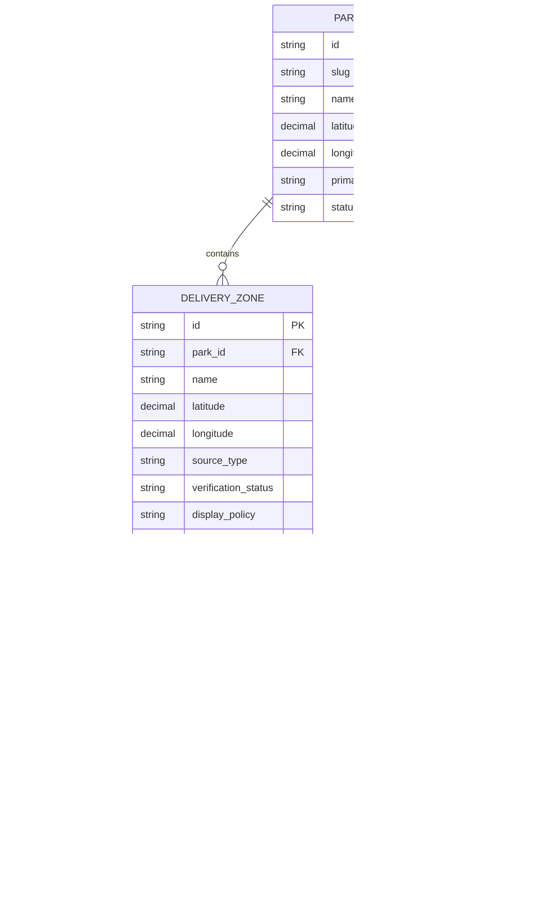
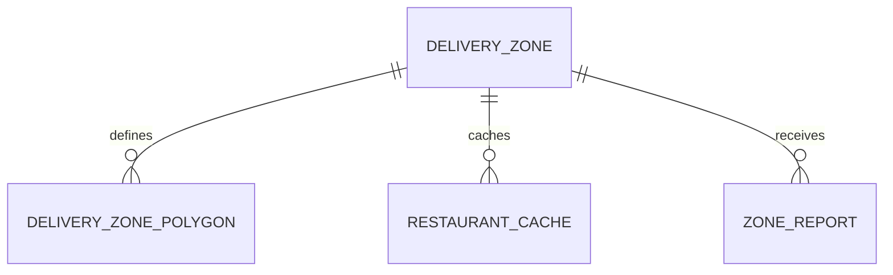

# Domain Model And ERD

## 문서 목적
이 문서는 현재 코드베이스에 이미 반영된 도메인 구조와, 아직 남아 있는 목표 확장 구조를 구분해서 정리한다.

## 현재 구현 스냅샷
- `park_delivery_zones` 중심 구조에서 `delivery_zones` 독립 엔티티 구조로 이미 전환됐다.
- supporting table로 `delivery_zone_evidences`, `zone_reviews`, `park_access_points`가 생성돼 있다.
- public park API는 아직 `GET /api/parks/{id}` 기준이며, `parks.slug`는 DB와 repository에만 반영된 상태다.
- 현재 seed 데이터에서는 `id`와 `slug` 값이 같지만, public 응답과 프론트 타입은 `id`를 상세 식별자로 사용한다.
- 배달존 공개 정책 필드명은 문서상의 `visibility`가 아니라 현재 코드 기준 `displayPolicy`다.
- `park_access_points`는 테이블만 준비됐고 public API/프론트에서는 아직 활용되지 않는다.
- `delivery_zone_polygons`, `restaurant_cache`, `zone_reports`는 아직 미구현이다.

## 목표 설계 원칙
- 배달존은 공원 내부 필드가 아니라 독립 엔티티다.
- 공개 데이터와 운영 데이터는 같은 엔티티를 공유하되 `displayPolicy` 정책으로 분리한다.
- 출처와 검수 이력은 별도 테이블로 관리한다.
- 지도 좌표 외에 polygon, landmark, 접근 팁을 지원한다.
- 현재 프론트 호환을 위해 `GET /api/parks` 응답은 한동안 유지할 수 있어야 한다.

## 현재 구현된 엔티티

### Park
- 공원의 기본 정보
- public 상세 조회 식별자는 현재 `id`
- `slug`, `status`는 DB 필드로 존재하지만 public 응답에는 아직 노출되지 않음

### DeliveryZone
- 배달 수령 위치의 핵심 엔티티
- `displayPolicy`, `verificationStatus`, `confidenceScore`, `coordinateSource`, `isOfficial`이 현재 구현에 포함됨

### DeliveryZoneEvidence
- 출처 URL, 발췌 문구, 확인일, evidence score 저장

### ZoneReview
- 운영 검수 기록 저장

### ParkAccessPoint
- 테이블은 존재하지만 public API와 프론트 연결은 미구현

## 목표 확장 엔티티

### DeliveryZonePolygon
- 점 좌표 외에 다각형이나 범위형 존을 표현

### RestaurantCache
- 배달존 기준 주변 맛집 캐시

### ZoneReport
- 사용자 현장 제보

## 현재 구현 필드

### `parks`
- `id`
- `slug`
- `name`
- `latitude`
- `longitude`
- `primary_tag`
- `description`
- `recommendation`
- `status`

주의:
- 현재 public API와 프론트 타입은 `slug`가 아니라 `id`를 상세 식별자로 사용한다.

### `delivery_zones`
- `id`
- `park_id`
- `name`
- `latitude`
- `longitude`
- `description`
- `address`
- `source_type`
- `verification_status`
- `source_label`
- `source_url`
- `source_checked_at`
- `coordinate_source`
- `display_policy`
- `confidence_score`
- `is_official`

### `delivery_zone_evidences`
- `id`
- `delivery_zone_id`
- `source_type`
- `source_label`
- `source_url`
- `source_excerpt`
- `checked_at`
- `evidence_score`
- `is_primary`

### `zone_reviews`
- `id`
- `delivery_zone_id`
- `review_status`
- `review_note`
- `reviewed_by`
- `reviewed_at`
- `result_confidence_score`

### `park_access_points`
- `id`
- `park_id`
- `name`
- `type`
- `latitude`
- `longitude`
- `address`
- `note`

## 목표 확장 필드

### `parks`
- `id`
- `slug`
- `name`
- `latitude`
- `longitude`
- `primary_tag`
- `description`
- `recommendation`
- `status`

### `delivery_zones`
- `id`
- `park_id`
- `slug`
- `name`
- `latitude`
- `longitude`
- `address`
- `landmark_name`
- `landmark_note`
- `walkway_note`
- `source_type`
- `verification_status`
- `display_policy`
- `confidence_score`
- `coordinate_source`
- `is_official`
- `last_verified_at`
- `expires_at`

### `delivery_zone_polygons`
- `id`
- `delivery_zone_id`
- `geojson`
- `version`
- `created_at`

### `restaurant_cache`
- `id`
- `delivery_zone_id`
- `provider`
- `provider_place_id`
- `name`
- `category_name`
- `latitude`
- `longitude`
- `distance_meters`
- `place_url`
- `updated_at`

### `zone_reports`
- `id`
- `delivery_zone_id`
- `report_type`
- `message`
- `status`
- `created_at`

## 현재 구현 ERD

## 목표 확장 ERD

## enum 권장안

### `source_type`
- `official`
- `community_verified`
- `unverified`

### `verification_status`
- `verified`
- `needs_review`
- `rejected`
- `expired`

### `display_policy`
- 현재 구현:
  - `public`
  - `limited`
  - `ops_only`

### `coordinate_source`
- `official`
- `geocoded`
- `manual`
- `community_refined`

## 공개 정책 규칙
- `public`
  - 공식 또는 운영상 공개 가능한 고신뢰 지점
- `limited`
  - 후보지만 공개 가치가 있어 안내는 하되 강한 주의 문구 필요
- `ops_only`
  - 내부 검수 전용
- `verification_status = rejected`
  - `displayPolicy`와 무관하게 public API와 사용자 화면에서 제외
- low-confidence 경고 기준
  - `displayPolicy = limited` 또는 `confidence_score < 70`

## confidence score 가이드
- `90~100`
  - 공식 문서 또는 공식 지도에서 직접 확인
- `70~89`
  - 독립 출처 2개 이상 교차 검증
- `40~69`
  - 단일 출처 또는 주소/랜드마크 정황만 확인
- `0~39`
  - 내부 초안, 공개 비권장

## 현재 코드베이스 전환 전략

### Step 1. 호환성 유지
- 기존 `parks` 응답의 `deliveryZones` 배열은 유지한다.
- 내부 구현만 독립 테이블 조회로 바꾼다.

### Step 2. 운영 필드 확장
- 현재 CSV의 `evidence_count`, `is_delivery_zone_explicit`, `review_note`를 evidence/review 테이블로 이관한다.

### Step 3. 상세 도메인 추가
- `delivery_zone_polygons`
- `zone_reports`
- `restaurant_cache`
- `park_access_points` public API 연결

### Step 4. 공개 정책 강화
- 저신뢰 지점은 `limited` 또는 `ops_only` 정책으로 분기한다.
- `limited`는 경고형 공개, `ops_only`는 비공개 검수 전용으로 사용한다.

## 권장 마이그레이션 순서
1. `parks`에 `slug`, `status` 추가
2. `delivery_zones` 독립 테이블 생성
3. 기존 `park_delivery_zones` 데이터를 이관
4. evidence/review 테이블 생성 후 CSV 이관
5. API mapper를 새 구조에 맞게 교체
6. 프론트는 점진적으로 `zoneId` 기반 상세 조회 도입
